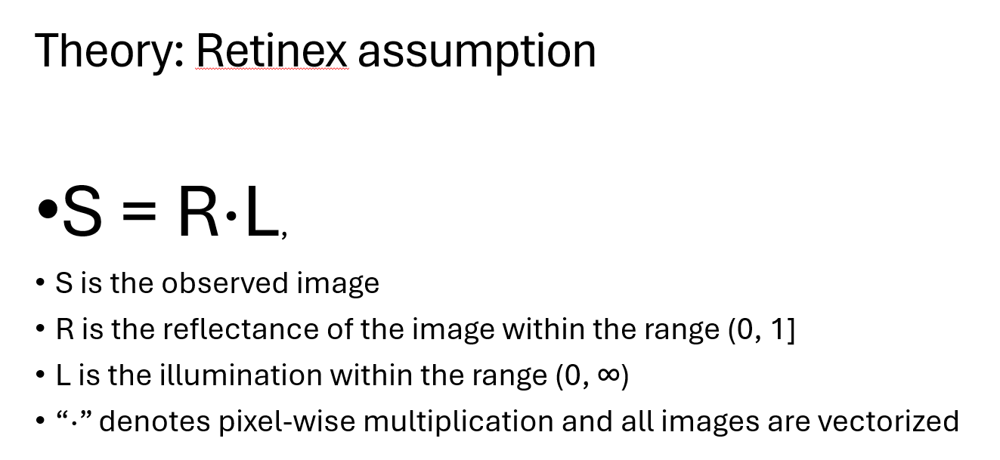
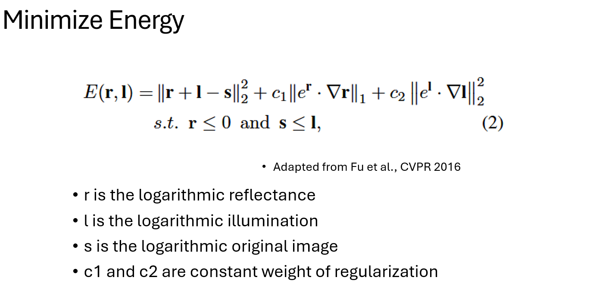
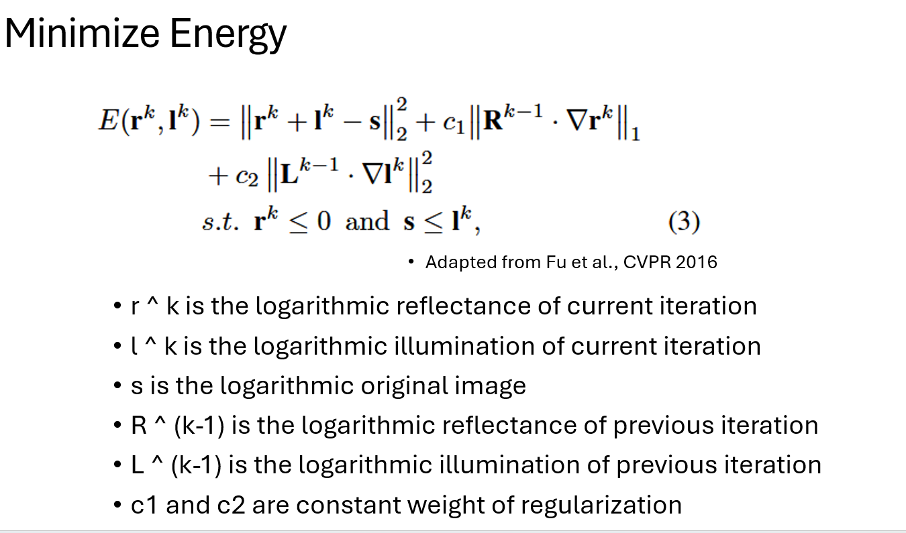
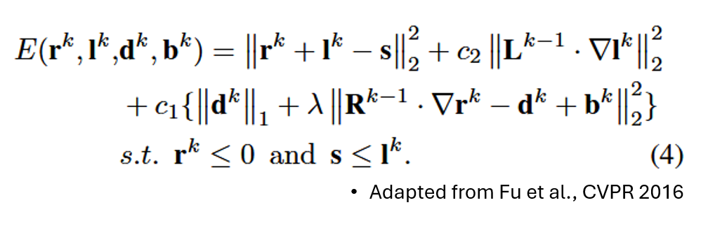
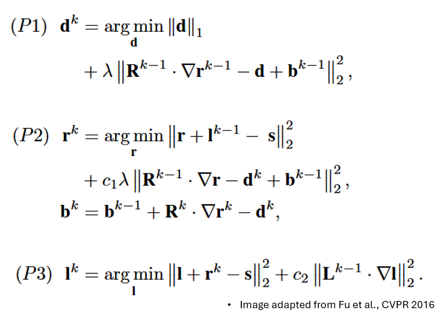
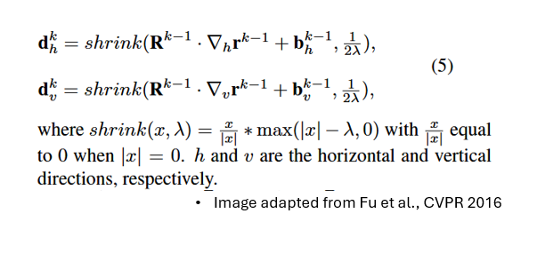
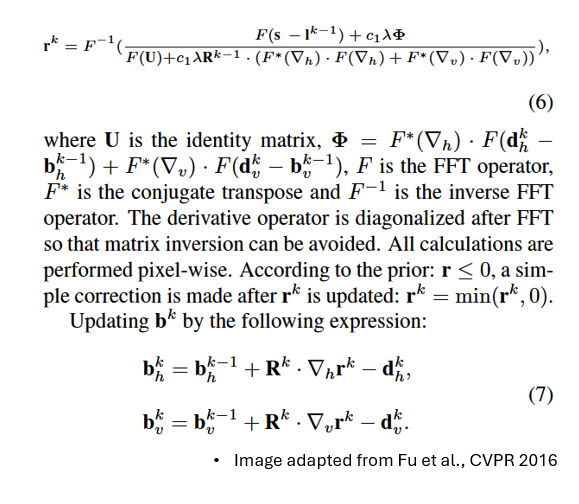
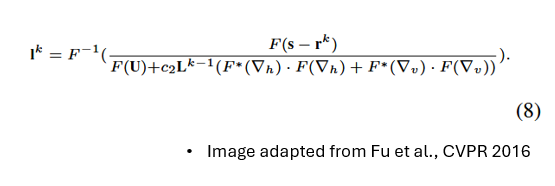
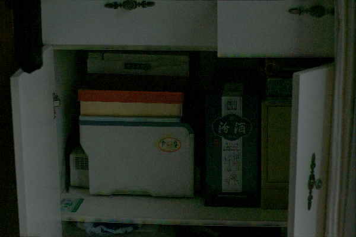

By Haoyu Wang, hwang2376@wisc.edu

{: .hightlight}
>Motivation:  
>Many images captured at night or in dim indoor environments are extremely dark. Important regions such as faces, hands, roads, and objects become very difficult to see, which hurts both human perception and downstream vision algorithms. Low-light images suffer from low visibility, low contrast, and noise. Simple methods like Gamma Correction or Histogram Equalization often fail to preserve edges or amplify noise globally. To address this, I build on the Retinex assumption that an observed image can be decomposed into reflectance (intrinsic scene structure) and illumination (lighting). In particular, I adopt the weighted variational Retinex model proposed by Fu et al., which is designed to better preserve fine details while correcting low-light illumination.

The Approach:

According to Retinex assumption, the image can be separated into reflectance and illumination. The core insight of the weighted variational Retinex model is to estimate reflectance and illumination from the source image, gamma correct the derived illumination, and conduct dot product of the corrected illumination with the reflectance to enhance image lighting/illumination.

The objective function has two assumptions:

1: Illumination is smooth (Simple Lighting condition).

2: Reflectance changes sharply (Different objects tend to have discrete reflectance).

Given those two assumptions, the illumination term is penalized by L2 norm to enforce spatial smoothness, and the reflectance is penalized by L1 norm to enforce spatial smoothness.

The fidelity term penalizes the difference of the restored image and the original image.

All terms are in log-domain so S=L⋅R in Retinex assumption can be transformed into s=l+r which, which allows the fidelity term to be convex for convenience to solve.

However, the objective function (2) is not convex giving the multiplication inside L1 norm and L2 norm. For convenience to solve, Fu et al. proposes an iterative method to approach the objective function (2):

To clarify a Q&A question during my presentation, the original problem with objective function (2) is not convex and is hard to tell whether a global minimum exists. However, the minimization problem with objective (3) does have a global minimum and it is a convex problem since we can consider r ^ (k-1) and l ^ (k-1) as constants. 

----------------------------------

TO SOLVE this objective function, Fu et al. proposes to use ADMM due to the non-smoothness of the L1 norm, and the augmented Lagrangian (the dual problem) is constructed as the following:

According to alternating direction method of multipliers (ADMM) theory, solving this Lagrangian is equivalent to solving the original objective function.

And this DUAL problem can be separated, in ADMM style, into three iterative subproblems - each built upon the previous and all three subproblems have close form global minimum.

Note: b is scaled dual / Bregman variable 

P1:

If we take A = R ^ (k-1) dot (divergence) r ^ (k-1) dot + b ^ (k-1). This A is constant from previous iteration.

We can separete P1 to further set of subproblems

min abs(d1) + lam(A - d) ^ 2

This problem can be solved by: 

P2:

Given P2 is least-square problem, r ^ k can be solved by setting first derivative to zero. Xu et al. propose the use of fast fourier transformation (FFT) to accerate the process.

Note 1: the constraint r ^ k <= 0 is accomplished by r ^ k = min(r & k, 0)

Note 2: the derivation of the updating policy of P2's r can be found in github repository upper right in directory "P2 hand writing derivation"

P3:

P3 is simular to P2 both in problem form and solving method:

Note 3: the constraint l ^ k >= s is accomplished by l ^ k = max(l ^ k, s)

By solving iteratively untill closure or max iteration, we can estimate reflectance and illumination and gamma correct illumination.

---------------------
Implementation:
I implemented the weighted variational Retinex model in Python using NumPy, rfft2, irfft2 from scipy.fft import 

The code implementation most follows the idea of Fu et al, and most hyper-parameters are same to those used in the paper. 

Besides the steps in the paper I added a boundary handling in pipeline: a custom psf2otf function with circular shifting to strictly match Matlab's behavior and avoid phase errors in FFT.

Moreover, there is a Major difference in my implementation: During the derivation of r's updating policy, I found that, for mathmatics correctness, R ^ (k-1) in formula(6) should be the square of R ^ (k - 1) and {should not} put outside of D and Dt (at page 3 of my derivation). However, Fu et al. treat R ^ (k-1), a diagonal matrix, as a constant scalar and put it outside of D and Dt so that the algorithm can use FFT to accerlate the calulation. In addition, Fu et al. might use R * (k-1) instead of its square to increase the effect of regularzation to overcome the effect of scalarize R ^ (k -1).

To adapt this engineering trick, I used the average of R ^ (k -1) in my implementation, and this would cause the solver to stick at the ordinary solution, not moving, and degrade into normal gamma correct algorithm. So, I increase c2 and lam to make harsher penity.

This failure results in mush faster convergence rate in my previous experiments as it only iterate 1 or 2 times and then do the gamma corret.

Exact code can be found at the upper right github repository

--------------------

Result:

The result of the weighted variational Retinex model 

Decomposition:

- Original image

- Reflectance

- Illumination

- Enhanced image

Enhancement:

- Original image

- Reflectance

- Illumination

- Enhanced image

Better than naive enhancement (*3 to all pixel value):

- Original image

- Naive 

- This model

- Original image

- Naive 

- This model

Naive method is very weak in term of robustness. It over-exposed/clipping pixel value when the original pixel value * coefficient is greater than 255. In this case, details lost in highlights. Moreover, it amplifies noises and lost contrast even when the pixel value is not over-exposed, while the weighted variational Retinex model perserves the texture and supress noise efficiently.

Better than just gamma correction:

- Original image

- Gamma 

- This model

- Original image

- Gamma

- This model

Gamma vs. ADMM: Simple Gamma correction simply brightens pixels. ADMM Retinex actually "hallucinates" structure from the dark by removing the smooth illumination layer, revealing textures that were mathematically hidden in the multiplication.

Interesting overshoot:

- Original

- Reflectant

- Illumination

- Error Output

- Recovered Output

at this hyper-parameter setting, the green channel overshoot and leave this result:

The problem was solve by tuning the parameters letting the solver to take less aggressive moves

More interesting details could be found at overshoot directory in repository

Other interestion findings:

Color Channels: The Green channel often converges differently than Red/Blue because typical camera sensors are more sensitive to Green, resulting in different signal-to-noise ratios in low light.

---------------------

More interesting examples can be found in my repository.

---------------------

Reference:

X. Fu, D. Zeng, Y. Huang, X.-P. Zhang, and X. Ding, “A weighted variational model for simultaneous reflectance and illumination estimation,” in Proceedings of the IEEE Conference on Computer Vision and Pattern Recognition (CVPR), 2016, pp. 2782–2790.

Some testing images sources are 

- igorovsyannykov from pixabay https://pixabay.com/photos/active-backlit-bicycle-bike-biking-2834137/

- Haoyu Wang, laptop camera

- Studio 7042 in People https://negativespace.co/backlit-woman-bicycle/

- LECARM dataset https://github.com/baidut/LECARM/blob/master/image/1.JPG

- wandb.ai https://wandb.ai/ml-colabs/low-light-enhancement/reports/Low-Light-Image-Enhancement-Lighting-up-Images-in-the-Deep-Learning-Era--VmlldzozNzE4Njkz

- lol dataset https://www.kaggle.com/datasets/soumikrakshit/lol-dataset

[Retinex_formula]: ./imgs/Retinex_formular.png
[Model]: ./imgs/model.png
[Lagrangian]: ./imgs/lagrangian.png
[2]: ./imgs/2.png
[subproblem]: ./imgs/subproblem.png
[p1]: ./imgs/P.png
[p2]: ./imgs/p2.png
[p3]: ./imgs/p3.png